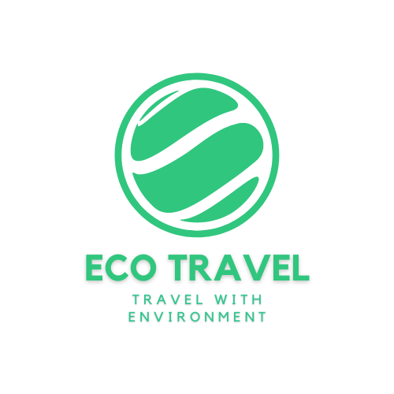
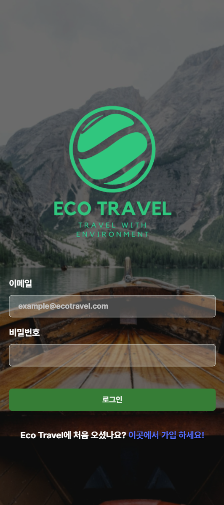
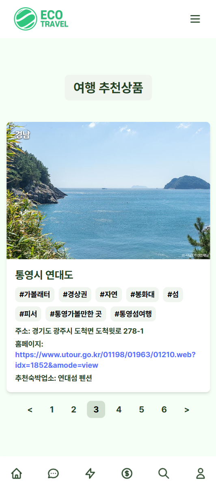
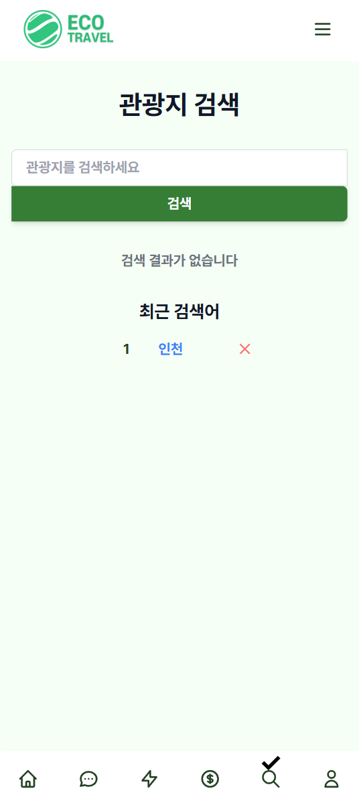
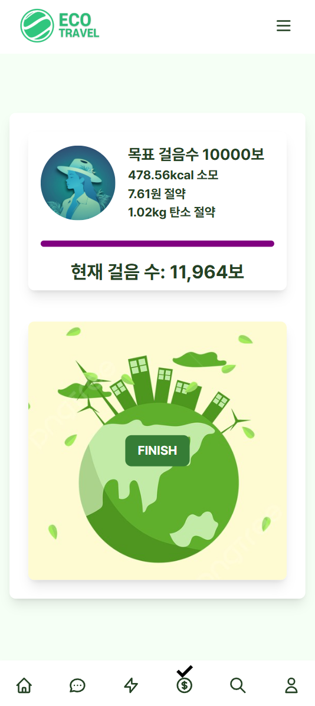
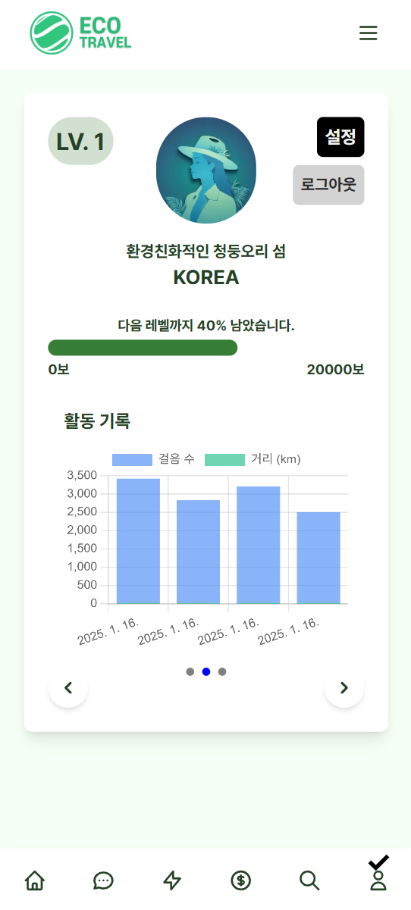
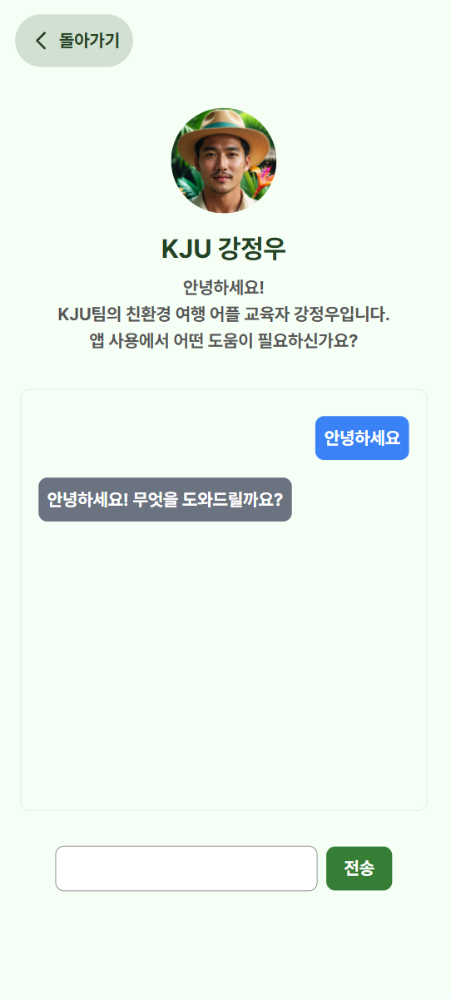

# Eco Travel Web Application

<p align="center">
  
</p>

<p align="left">
  <strong>Available README Languages :</strong>
  <a href="./README.md">KR</a> | <a href="./README_EN.md">EN</a> | <a href="./README_ZH.md">ZH</a>
</p>
<p align="center">
  <strong>Welcome to the Eco-Travel Web Application!</strong><br>
  This application is designed to promote sustainable travel and environmental protection. Built with Next.js, this platform empowers travelers to make eco-friendly choices and gain insights into their environmental impact through various features.
</p>

## Key Features

### 🌍 Sustainable Travel Recommendations

### 📚 Information & Resources

### 💬 User Interaction & Sharing

### 🧠 Intelligent Assistance

### ♻️ Carbon Footprint Calculator (Pedometer)

## Demo

> Try it out for yourself at https://eco-travel.netlify.app! (All features are available except for Google paid services)

### Login / Sign up
<p align="center">
  
</p>

### Home Screen
<p align="center">
  
</p>

### Community
<p align="center">
  
</p>

### Travel recommendations page
<p align="center">
  
</p>

### carbon footprint pedometer
<div style="display: flex; justify-content: space-between;">
  
  
</div>

### Destination search page
<p align="center">
  
</p>

### Rewards eligibility/redemption page
<p align="center">
  
</p>

### Rewards advertising page
<p align="center">
  
</p>

### My page
<div style="display: flex; justify-content: space-between;">
  
  
  
</div>

### App AI assistant
<p align="center">
  
</p>

## Getting Started

To start the project, follow these steps:

1. **Clone the Repository**

```bash
   git clone https://github.com/tionlab/eco-trav.git
```

2. **Navigate to the Project Directory**

```bash
   cd eco-travel-app
```

3. **Install Dependencies**

```bash
   npm install
```

4. **Update .env.local**

Modify the .env file with your own keys.

5. **Run the Development Server**

```bash
   npm run dev
```

The app will run at http://localhost:3000.

## Notes

-   The `pages/download.js` file uses `public/ecotravel.apk`. Add the APK to `public/` or remove `pages/download.js` if you do not need this functionality.
-   The AI chat feature in `pages/aichat.js` is not yet implemented by default. Please customize this file to integrate AI chat.
-   You can enable the ClickIndicator feature by uncommenting the `ClickIndicator` in `pages/_app.js`.
-   Generative AI was used to create some of the image assets.
- The demo ad shown when rewarding is [a public service announcement produced by the Ministry of the Environment](https://www.youtube.com/watch?v=cCW6eKySZjk).

## Contributing

Contributions to improve the Eco-Travel Web Application are welcome! If you have suggestions, bug reports, or feature requests, please create an issue or submit a pull request.

1. **Fork the Repository**
2. **Create a Feature Branch**

```bash
   git checkout -b feature/your-feature
```

3. **Commit Your Changes**

```bash
   git commit -am 'Add new feature'
```

4. **Push to Your Branch**

```bash
   git push origin feature/your-feature
```

5. **Create a Pull Request**
