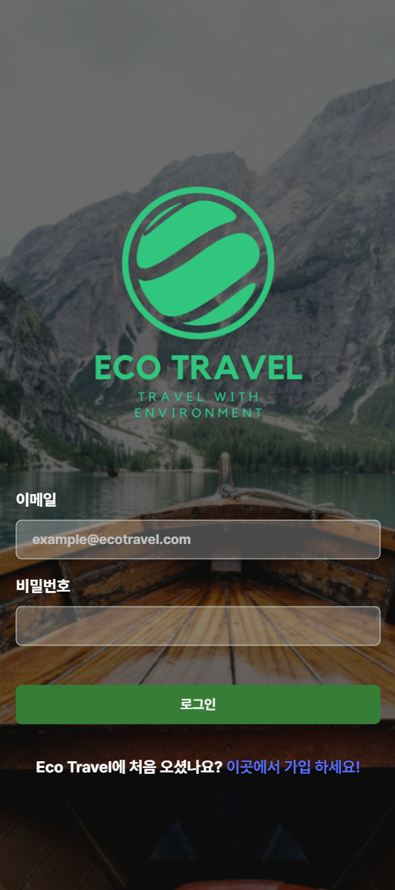
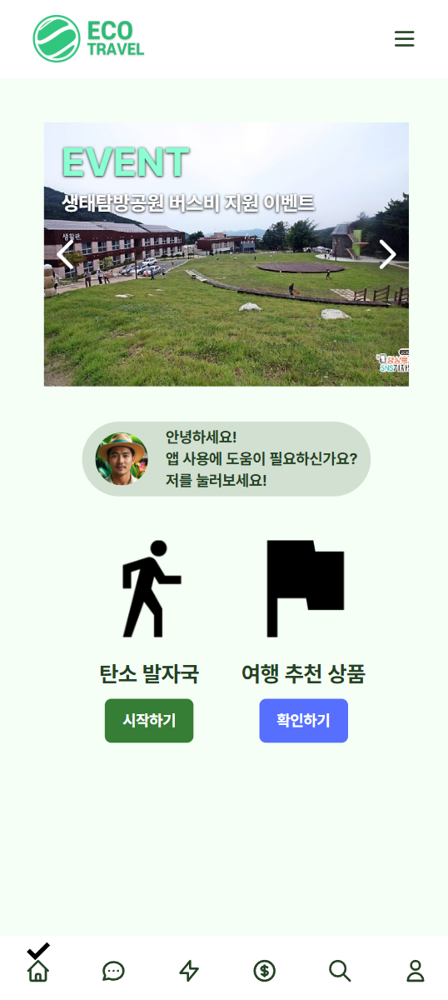
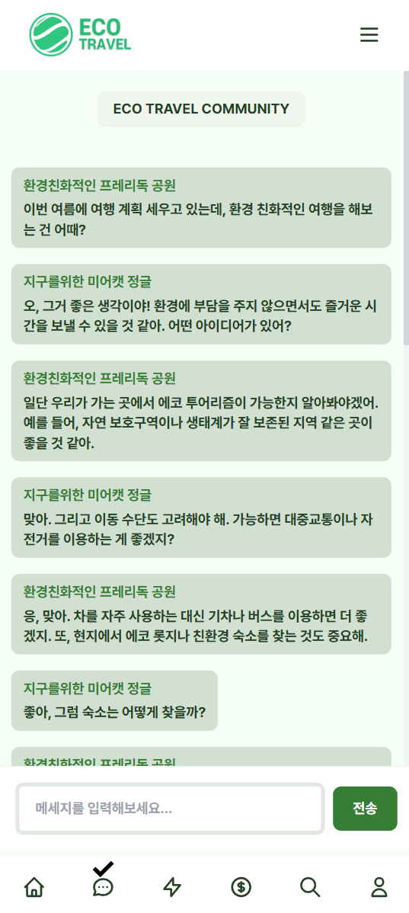
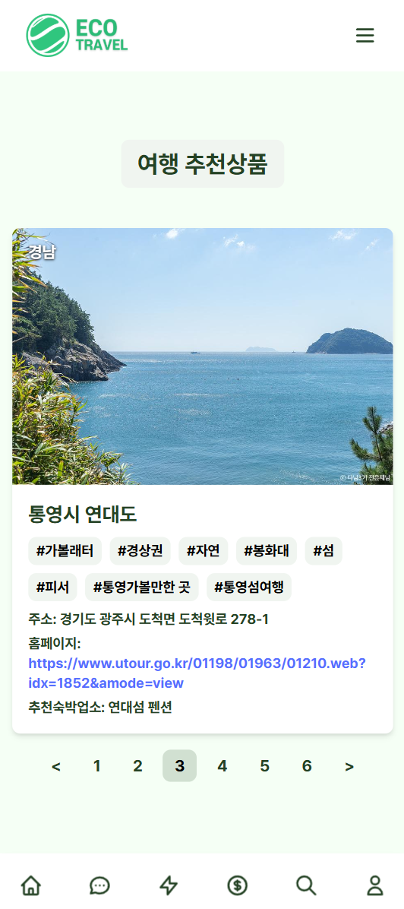
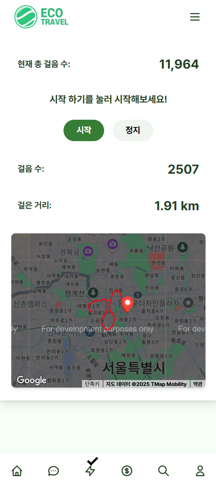
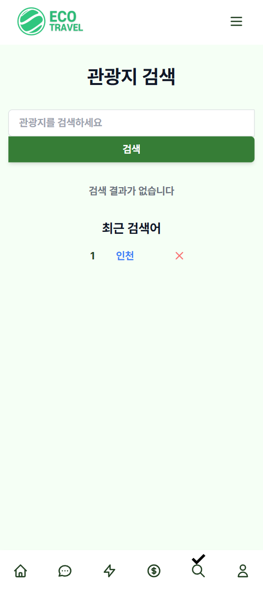
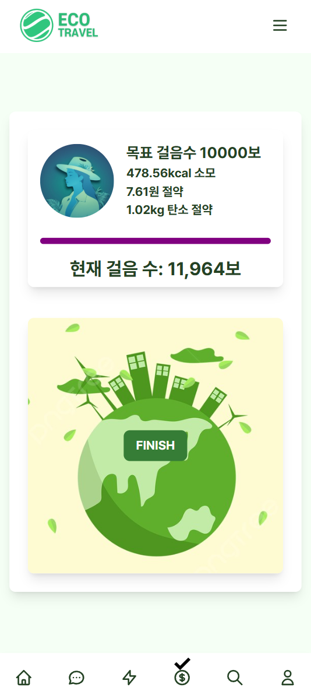
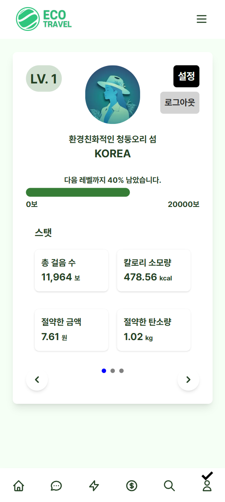
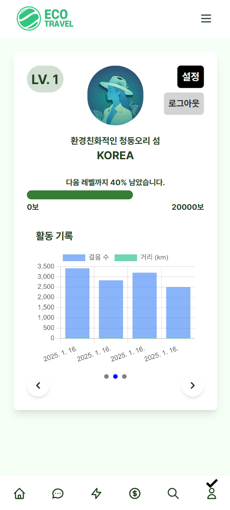
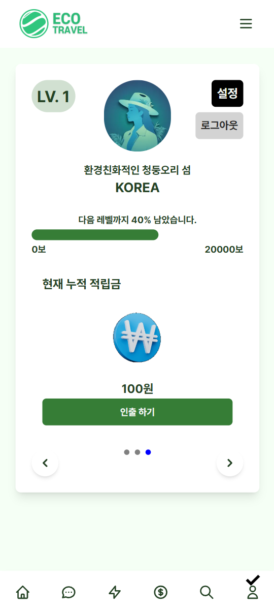

# Eco Travel Web 应用程序

<p align="center">
  
</p>

<p align="left">
  <strong>Available README Languages :</strong>
  <a href="./README.md">KR</a> | <a href="./README_EN.md">EN</a> | <a href="./README_ZH.md">ZH</a>
</p>
<p align="center">
  <strong>欢迎来到Eco-Travel网页应用程序！</strong><br>
  本应用程序旨在促进可持续旅游和环境保护。通过Next.js构建，Eco-Travel帮助旅行者做出环保选择，并了解其行为对环境的影响。
</p>

## 主要功能

### 🌍 可持续旅游推荐

### 📚 信息和资源提供

### 💬 用户间信息共享

### 🧠 智能助理

### ♻️ 碳足迹计算器（步数计）

## 演示

> 請上 https://eco-travel.netlify.app 試用！(除 Google 付費服務外，所有功能均可用)

### 登入 / 註冊
<p align="center">
  
</p>

### 首頁畫面
<p align="center">
  
</p>

### 社區
<p align="center">
  
</p>

### 旅遊建議頁面
<p align="center">
  
</p>

### 碳足跡計步器
<div style="display: flex; justify-content: space-between;">
  
  
</div>

### 目的地搜尋頁面
<p align="center">
  
</p>

### 獎勵資格/兌換頁面
<p align="center">
  
</p>

### 獎勵廣告頁面
<p align="center">
  
</p>

### 我的頁面
<div style="display: flex; justify-content: space-between;">
  
  
  
</div>

### 應用程式 AI 助理
<p align="center">
  
</p>

## 快速开始

要启动项目，请按以下步骤操作：

1. **克隆存储库**

```bash
   git clone https://github.com/tionlab/eco-trav.git
```

2. **进入项目目录**

```bash
   cd eco-travel-app
```

3. **安装依赖项**

```bash
   npm install
```

4. **编辑.env.local**

使用您的密钥修改.env 文件。

5. **启动开发服务器**

```bash
   npm run dev
```

应用程序将在 http://localhost:3000 上运行。

## 注意事项

-   `pages/download.js` 使用 `public/ecotravel.apk` 文件。可以选择创建 APK 并添加到此文件中，或删除 `pages/download.js` 以移除该功能。
-   `pages/aichat.js` 未集成 AI 聊天功能，您可以在此文件中自行添加。
-   在 `pages/_app.js` 中取消对 `ClickIndicator` 的注释，以启用该功能。
-   部分图像文件由生成式 AI 创建。
- 獎勵時顯示的示範廣告是 [環境部製作的公益廣告](https://www.youtube.com/watch?v=cCW6eKySZjk)。

## 贡献

欢迎为 Eco-Travel 网页应用程序的改进贡献力量！如果您有建议、Bug 报告或功能请求，请创建一个 Issue 或提交 Pull Request。

1. **Fork 存储库**
2. **创建功能分支**

```bash
   git checkout -b feature/your-feature
```

3. **提交更改**

```bash
   git commit -am '添加新功能'
```

4. **推送分支**

```bash
   git push origin feature/your-feature
```

5. **创建 Pull Request**
